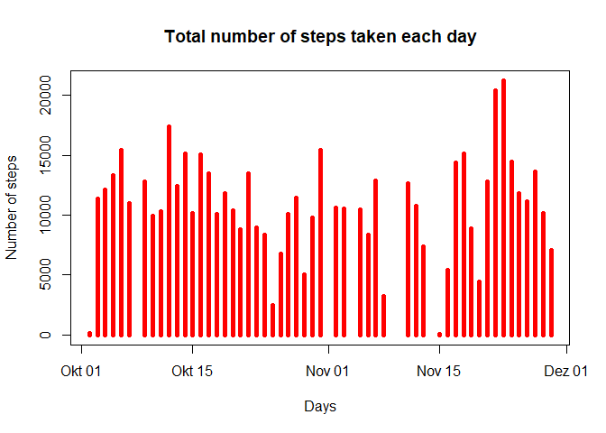
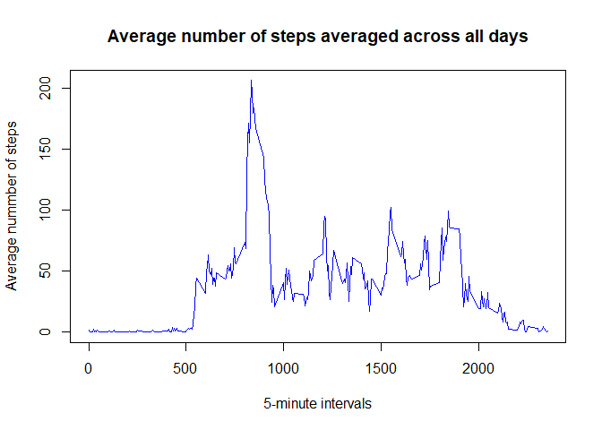
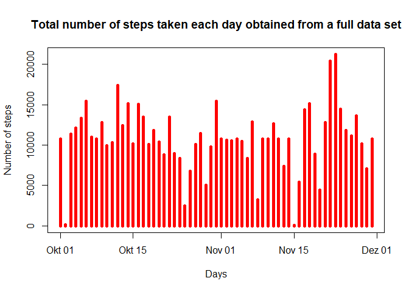
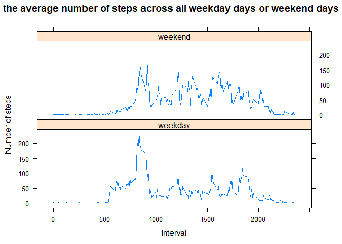

## Introduction

This assignment makes use of data from a personal activity monitoring device. This device collects data at 5 minute intervals through out the day. The data consists of two months of data from an anonymous individual collected during the months of October and November, 2012 and include the number of steps taken in 5 minute intervals each day.

The data for this assignment can be downloaded from the course web site:

Dataset: [Activity monitoring data](https://d396qusza40orc.cloudfront.net/repdata%2Fdata%2Factivity.zip) [52K]

The variables included in this dataset are:

**steps**: Number of steps taking in a 5-minute interval (missing values are coded as NA)

**date**: The date on which the measurement was taken in YYYY-MM-DD format

**interval**: Identifier for the 5-minute interval in which measurement was taken

The dataset is stored in a comma-separated-value (CSV) file and there are a total of 17,568 observations in this dataset.

Within this Assignment, one should address the following issues:

## Loading and preprocessing the data:

According to the extension of the data file "*activity.csv*" in working directory, we read the data in the variable **activity** using:


```r
activity <- read.csv("activity.csv")
activity$date <- as.Date(activity$date, format="%Y-%m-%d")
str(activity)
```

```
## 'data.frame':	17568 obs. of  3 variables:
##  $ steps   : int  NA NA NA NA NA NA NA NA NA NA ...
##  $ date    : Date, format: "2012-10-01" "2012-10-01" ...
##  $ interval: int  0 5 10 15 20 25 30 35 40 45 ...
```


## What is mean total number of steps taken per day?

1. We first calculate the total number of steps taken per day:


```r
StepsPerDay <- activity %>% na.omit() %>% group_by(date) %>% summarise(TotSteps = sum(steps))
StepsPerDay
```

```
## # A tibble: 53 x 2
##    date       TotSteps
##    <date>        <int>
##  1 2012-10-02      126
##  2 2012-10-03    11352
##  3 2012-10-04    12116
##  4 2012-10-05    13294
##  5 2012-10-06    15420
##  6 2012-10-07    11015
##  7 2012-10-09    12811
##  8 2012-10-10     9900
##  9 2012-10-11    10304
## 10 2012-10-12    17382
## # ... with 43 more rows
```

2. Then, we make a histogram of the total number of steps taken each day:


```r
plot(StepsPerDay$date, StepsPerDay$TotSteps, type="h", lwd=5, col="red", xlab="Days", ylab="Number of steps", main="Total number of steps taken each day")
```

<!-- -->

3. And finally, we calculate and report the mean and median of the total number of steps taken per day


```r
mean(StepsPerDay$TotSteps)
```

```
## [1] 10766.19
```

```r
median(StepsPerDay$TotSteps)
```

```
## [1] 10765
```

## What is the average daily activity pattern?

1. Make a time series plot (i.e. type = "l") of the 5-minute interval (x-axis) and the average number of steps taken, averaged across all days (y-axis)


```r
MeanInterval <- aggregate(activity$steps, by=list(interval=activity$interval), FUN = mean, na.rm = TRUE)
plot(MeanInterval$interval, MeanInterval$x, type = "l", col = "blue", xlab = "5-minute intervals", ylab = "Average nummber of steps", main = "Average number of steps averaged across all days")
```

<!-- -->

2. Which 5-minute interval, on average across all the days in the dataset, contains the maximum number of steps?


```r
MeanInterval[which.max(MeanInterval$x),]
```

```
##     interval        x
## 104      835 206.1698
```


## Imputing missing values

1. Calculate and report the total number of missing values in the dataset (i.e. the total number of rows with NAs)


```r
sum(is.na(activity$steps))
```

```
## [1] 2304
```

2. As a strategy for filling in all of the missing values in the dataset I use **dplyr** to group the data according to the day and replace the NA with the average number of step across all days of its corresponding interval (from the table **MeanInterval**).


3. Create a new dataset that is equal to the original dataset but with the missing data filled in.


```r
activityFull <- activity %>% group_by(date) %>% mutate(steps = ifelse(is.na(steps), MeanInterval$x[match(interval, MeanInterval$interval)], steps))
```

4.Make a histogram of the total number of steps taken each day and Calculate and report the mean and median total number of steps taken per day. Do these values differ from the estimates from the first part of the assignment? What is the impact of imputing missing data on the estimates of the total daily number of steps?


```r
StepsPerDayFull <- activityFull %>% group_by(date) %>% summarise(TotSteps = sum(steps))
plot(StepsPerDayFull$date, StepsPerDayFull$TotSteps, type="h", lwd=5, col="red", xlab="Days", ylab="Number of steps", main="Total number of steps taken each day obtained from a full data set")
```

<!-- -->


```r
Recap <- xtable(cbind(c("Without \"NA\"", "With \"NA\""), c(mean(StepsPerDayFull$TotSteps), mean(StepsPerDay$TotSteps)), c(median(StepsPerDayFull$TotSteps), median(StepsPerDay$TotSteps))))
colnames(Recap) <- c("Type of data set", "Mean", "Median")
rownames(Recap) <- NULL
print(Recap, include.rownames=FALSE, type="html")
```

<!-- html table generated in R 3.4.3 by xtable 1.8-2 package -->
<!-- Sun Feb 18 03:35:12 2018 -->
<table border=1>
<tr> <th> Type of data set </th> <th> Mean </th> <th> Median </th>  </tr>
  <tr> <td> Without "NA" </td> <td> 10766.1886792453 </td> <td> 10766.1886792453 </td> </tr>
  <tr> <td> With "NA" </td> <td> 10766.1886792453 </td> <td> 10765 </td> </tr>
   </table>

## Are there differences in activity patterns between weekdays and weekends?

1. Create a new factor variable in the dataset with two levels – “weekday” and “weekend” indicating whether a given date is a weekday or weekend day.


```r
activityFull <- activityFull %>% mutate(WE = weekdays(date)) %>% mutate(WE = ifelse(WE == "Samstag"|WE == "Sonntag", "weekend", "weekday"))

# With the library "Chron":
# activityFulltest <- activityFull %>% mutate(WE = ifelse(is.weekend(date), "weekend", "weekday")

table(activityFull$WE)
```

```
## 
## weekday weekend 
##   12960    4608
```

2. Make a panel plot containing a time series plot (i.e. type = "l") of the 5-minute interval (x-axis) and the average number of steps taken, averaged across all weekday days or weekend days (y-axis). See the README file in the GitHub repository to see an example of what this plot should look like using simulated data.


```r
MeanIntervalFull <- aggregate(activityFull$steps, by=list(interval=activityFull$interval, WE=activityFull$WE), FUN = mean)
xyplot(x ~ interval | as.factor(WE), data = MeanIntervalFull, type = "l", xlab = "Interval", ylab = "Number of steps", main = "the average number of steps across all weekday days or weekend days", layout = c(1,2))
```

<!-- -->
